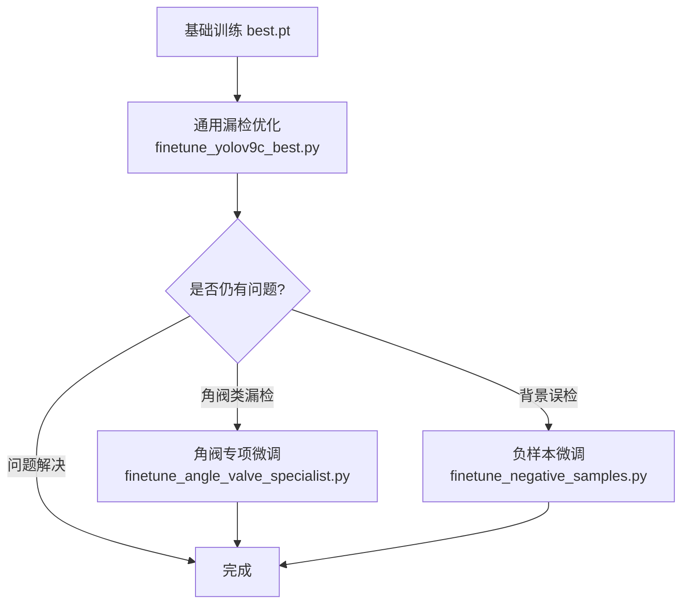

# YOLOv9c 专项微调脚本集合

本目录包含针对特定问题或场景的 YOLOv9c 微调脚本。每个脚本都基于不同的基础权重，针对特定目标进行优化。

---

## 📋 目录

1. [finetune_yolov9c_best.py](#1-finetune_yolov9c_bestpy) - 通用漏检优化微调
2. [finetune_angle_valve_specialist.py](#2-finetune_angle_valve_specialistpy) - 角阀类专项微调
3. [finetune_negative_samples.py](#3-finetune_negative_samplespy) - 负样本抑制微调

---

## 1. finetune_yolov9c_best.py

### 📅 创建时间
**2026-04-28**

### 🎯 微调目标
解决**九牧安全快开**和**九牧大冲力喷枪角阀**等类别的漏检问题，提升整体召回率。

### 📦 基础权重
```
outputs/yolov9c/20260428_105825/weights/best.pt
```
这是第一阶段基础训练（200 epochs）产生的最佳权重。

### 🔧 微调配置

| 参数 | 值 | 说明 |
|------|-----|------|
| **Epochs** | 100 | 精细化训练轮数 |
| **Batch Size** | 8 | 增大批次，稳定梯度 |
| **Learning Rate** | 0.002 | 降低学习率，精细调整 |
| **Optimizer** | AdamW (auto) | 自动选择优化器 |
| **Image Size** | 640 | 保持标准尺寸 |
| **Patience** | 50 | 早停容忍 |

### ✨ 关键改进点

#### 数据增强强化
```python
mosaic=1.0,           # 从 0.8 提升到 1.0，强制使用
mixup=0.1,            # Mixup 混合增强
copy_paste=0.2,       # 新增：复制粘贴增强
degrees=0.2,          # 小角度旋转
translate=0.2,        # 平移增强
scale=0.3,            # 缩放增强
```

#### 损失函数优化
```python
label_smoothing=0.1,  # 标签平滑，提升泛化
box=7.5,              # 边界框损失权重
cls=0.5,              # 分类损失权重
dfl=1.5,              # DFL 损失权重
```

#### 训练策略
```python
warmup_epochs=3.0,    # Warmup 阶段
close_mosaic=10,      # 最后 10 轮关闭 Mosaic
```

### 📊 预期效果
- ✅ 提升小目标检测能力
- ✅ 改善遮挡场景检测
- ✅ 提高召回率（特别是易漏检类别）
- ⚠️ 可能增加少量误检

### 🚀 使用方法
```powershell
cd E:\code\jomoo-testmodel
python -m train.finetune_scripts.finetune_yolov9c_best `
  --epochs 100 `
  --batch 8 `
  --imgsz 640 `
  --device 0
```

### 📁 输出位置
```
runs/detect/runs/jomoo/yolov9c_jomoo_finetune/weights/best.pt
```

---

## 2. finetune_angle_valve_specialist.py

### 📅 创建时间
**待补充**（请根据实际创建时间填写）

### 🎯 微调目标
专门针对**角阀类产品**（安全角阀、大冲力喷枪角阀、安全快开）进行专项优化，提升这些类别的检测精度和召回率。

### 📦 基础权重
```
[请填写使用的基础权重路径]
```
例如：`runs/detect/runs/jomoo/yolov9c_jomoo_finetune/weights/best.pt`

### 🔧 微调配置

| 参数 | 值 | 说明 |
|------|-----|------|
| **Epochs** | [待补充] | 训练轮数 |
| **Batch Size** | [待补充] | 批次大小 |
| **Learning Rate** | [待补充] | 学习率 |
| **重点类别** | 角阀相关 | 安全角阀、喷枪角阀、安全快开 |

### ✨ 专项优化内容

#### 类别权重调整
对角阀相关类别设置更高的权重，让模型更关注这些类别：
```python
# 示例配置（需根据实际情况调整）
class_weights = {
    '九牧安全角阀': 1.5,
    '九牧大冲力喷枪角阀': 2.0,
    '九牧安全快开': 1.8,
}
```

#### 针对性数据增强
- 增加角阀产品的旋转变化（不同角度摆放）
- 强化尺度变化（远近不同距离）
- 模拟货架遮挡场景

### 📊 预期效果
- ✅ 显著提升角阀类检测准确率
- ✅ 减少角阀与其他类别的混淆
- ✅ 改善密集排列场景的检测

### 🚀 使用方法
```powershell
python -m train.finetune_scripts.finetune_angle_valve_specialist `
  --epochs [轮数] `
  --batch [批次] `
  --device 0
```

### 📁 输出位置
```
runs/detect/runs/jomoo/yolov9c_angle_valve_specialist/weights/best.pt
```

### 📝 备注
⚠️ **此脚本需要完善**：请根据实际使用情况补充具体参数和效果说明。

---

## 3. finetune_negative_samples.py

### 📅 创建时间
**待补充**（请根据实际创建时间填写）

### 🎯 微调目标
通过引入**负样本**（不含任何目标的图片），降低背景误检率，提升模型的判别能力。

### 📦 基础权重
```
[请填写使用的基础权重路径]
```

### 🔧 微调配置

| 参数 | 值 | 说明 |
|------|-----|------|
| **Epochs** | [待补充] | 训练轮数 |
| **Batch Size** | [待补充] | 批次大小 |
| **Learning Rate** | [待补充] | 较低的学习率 |
| **负样本比例** | [待补充] | 负样本在批次中的占比 |

### ✨ 负样本处理策略

#### 负样本特点
- 空标签文件（.txt 为空或不存在）
- 包含货架背景、包装箱等非产品场景
- 帮助模型学习"什么不是产品"

#### 训练技巧
```python
# 示例配置
model.train(
    ...
    lr0=0.0005,         # 更低的学习率
    weight_decay=0.001, # 更强的正则化
    close_mosaic=5,     # 更早关闭 Mosaic
    ...
)
```

### 📊 预期效果
- ✅ 显著降低背景误检
- ✅ 提升模型对背景的鲁棒性
- ✅ 减少将货架、包装误认为产品的情况
- ⚠️ 可能略微降低召回率

### 🚀 使用方法
```powershell
python -m train.finetune_scripts.finetune_negative_samples `
  --epochs [轮数] `
  --batch [批次] `
  --device 0
```

### 📁 输出位置
```
runs/detect/runs/jomoo/yolov9c_negative_samples/weights/best.pt
```

### 📝 备注
⚠️ **此脚本需要完善**：请根据实际使用情况补充具体参数和效果说明。

---

## 🔗 相关工作流

### 推荐的微调顺序



### 权重演进路径

```
yolov9c.pt (COCO预训练)
    ↓ 基础训练 (200 epochs)
outputs/yolov9c/20260428_105825/weights/best.pt
    ↓ 通用微调 (100 epochs)
runs/detect/runs/jomoo/yolov9c_jomoo_finetune/weights/best.pt
    ↓ 专项微调 (可选)
├─→ yolov9c_angle_valve_specialist/weights/best.pt
└─→ yolov9c_negative_samples/weights/best.pt
```

---

## 📊 效果对比表

| 微调脚本 | 主要改进 | 适用场景 | 推理速度影响 |
|---------|---------|---------|-------------|
| **finetune_yolov9c_best** | 召回率↑ | 通用漏检 | 无影响 |
| **finetune_angle_valve_specialist** | 角阀精度↑ | 角阀密集场景 | 无影响 |
| **finetune_negative_samples** | 误检↓ | 背景复杂场景 | 无影响 |

---

## 💡 使用建议

### 1. 选择合适的微调脚本

- **一般漏检问题** → 使用 `finetune_yolov9c_best.py`
- **特定类别问题** → 使用对应的专项微调脚本
- **背景误检严重** → 使用 `finetune_negative_samples.py`

### 2. 微调前的检查清单

- [ ] 确认基础权重存在且有效
- [ ] 准备针对性的训练数据
- [ ] 备份当前最佳权重
- [ ] 设定明确的评估指标

### 3. 微调后的验证

```powershell
# 使用 test 集评估
python -m train.evaluate_test --model-name yolov9c

# 或在特定数据集上推理
python -m infer.infer_yolov9c `
  --weights [新权重路径] `
  --source [测试图片目录] `
  --conf 0.5 --iou 0.65
```

---

## 📝 版本记录

| 日期 | 脚本 | 更新内容 |
|------|------|---------|
| 2026-04-28 | finetune_yolov9c_best.py | 初始版本，通用漏检优化 |
| TBD | finetune_angle_valve_specialist.py | 待完善 |
| TBD | finetune_negative_samples.py | 待完善 |

---

## 🔗 相关文档

- [完整训练推理指南](../../TRAINING_AND_INFERENCE_GUIDE.md)
- [重叠检测解决方案](../../OVERLAP_DETECTION_SOLUTION.md)
- [项目 README](../../README.md)

---

**最后更新**: 2026-04-28 
